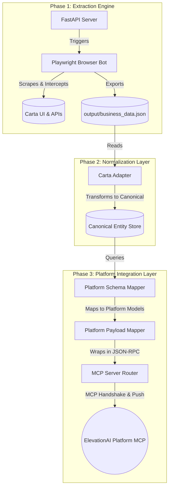

# Carta Extraction Agent: Architecture & Workflow

This document details the architecture, data flow, and components of the Carta Agent. The agent is designed to autonomously navigate Carta, extract structured financial data, normalize it into a canonical schema, and push it directly to the ElevationAI Platform via the Model Context Protocol (MCP).

---

## 1. High-Level Architecture

The system is broken down into three distinct phases: **Extraction**, **Normalization**, and **Integration**.

---

## 2. End-to-End Workflow (The Live Sync)

When a synchronization task is triggered, the following workflow executes autonomously:

1. **Trigger Phase**:
   - The user or AI agent calls the `download_report` tool on the MCP Server.
   - The MCP Server sends an HTTP request to the local FastAPI worker (`api/server.py`).
2. **Extraction Phase**:
   - The FastAPI worker spawns the Playwright automation script (`export_frontend_data.py`).
   - The bot logs into Carta (using a persistent session), intercepts raw GraphQL/REST network traffic, and traverses the company list, cap tables, and valuation data.
   - The extracted data is merged and dumped into `output/business_data.json`.
3. **Normalization Phase**:
   - Once extraction finishes, `sync_to_platform()` is triggered in the MCP Server.
   - `CartaAdapter` reads the JSON file and converts raw Carta structures (e.g., `fmv_409a`) into generalized OpenClaw models (e.g., `Valuation`, `PortfolioCompany`).
4. **Mapping Phase**:
   - `PlatformSchemaMapper` queries the canonical models and builds platform-specific schemas (e.g., `InvAssetValuation`).
   - `PlatformPayloadMapper` wraps these schemas into the exact arguments required by the Platform's `portfolio.investment.update` tool.
5. **Push Phase**:
   - The MCP Server performs an `initialize` JSON-RPC handshake with the ElevationAI Platform.
   - It extracts the `mcp-session-id` from the response.
   - It iterates through the generated payloads and sends a `tools/call` JSON-RPC request for each one to the Platform, updating the investments in real-time.

---

## 3. Core Components Directory

### 📍 Extraction Layer

- **`api/server.py`**: A FastAPI background worker that manages long-running extraction jobs. It prevents the MCP server from timing out during heavy scraping tasks.
- **`scripts/export_frontend_data.py`**: The core Playwright spider. It uses stealth techniques and intercepts network requests to build the raw JSON snapshot.
- **`scripts/start_persistent_browser.py`**: Starts a persistent Chrome session on port `9222`. This allows the developer to log in manually once and bypass 2FA/MFA blocks during automated runs.

### 📍 Normalization Layer (OpenClaw Standard)

- **`services/canonical_store.py`**: An in-memory database that holds all generalized entities (`Fund`, `PortfolioCompany`, `Valuation`, `Transaction`). It standardizes how data is stored, regardless of whether it came from Carta, PitchBook, or manual entry.
- **`services/adapters/carta_adapter.py`**: Translates Carta's specific JSON structure into the canonical entities.

### 📍 Platform Integration Layer

- **`services/platform_schema.py`**: Pydantic models defining the exact data shapes expected by the ElevationAI Platform (e.g., `InvAssetValuation`).
- **`services/platform_mapper.py`**: The bridge between the Canonical Store and the Platform Schemas. Contains business logic (like extracting the year from a date string).
- **`services/platform_payload_mapper.py`**: Wraps the raw data payloads into JSON-RPC formatting compliant with the MCP spec.

### 📍 Routing & Testing

- **`scripts/mcp_server.py`**: The primary brain of the agent. It exposes natural language tools to LLMs (like checking extraction status) and orchestrates the automatic push to the platform upon data updates.
- **`test_frozen_sync.py`**: A deterministic testing utility that bypasses Playwright, allowing developers to test platform ingestion using local snapshot data.

---

## 4. Security & Authentication Model

The integration is secured using **API Keys** and **Session-based MCP Handshakes**:

1. **Agent ➝ Platform Authentication**:
   - The agent requires `X_API_KEY` and `X_API_SECRET` to communicate with the ElevationAI platform.
   - These keys determine which Organization (`org_id`) and User (`user_id`) the data is being synced on behalf of.
2. **MCP Session Lifecycle**:
   - The agent initiates the connection by calling `method: "initialize"`.
   - The platform responds with `mcp-session-id` in the HTTP headers.
   - The agent attaches this session ID to all subsequent `tools/call` requests (e.g., `portfolio.investment.update`) to maintain stateful authorization.
