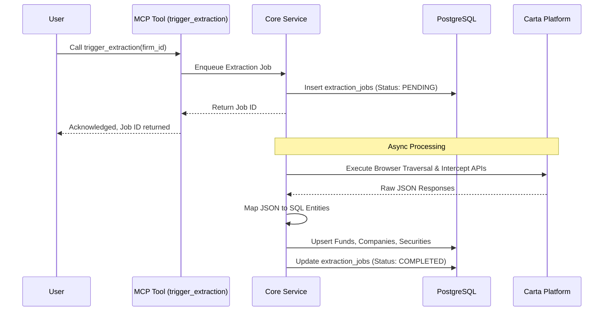
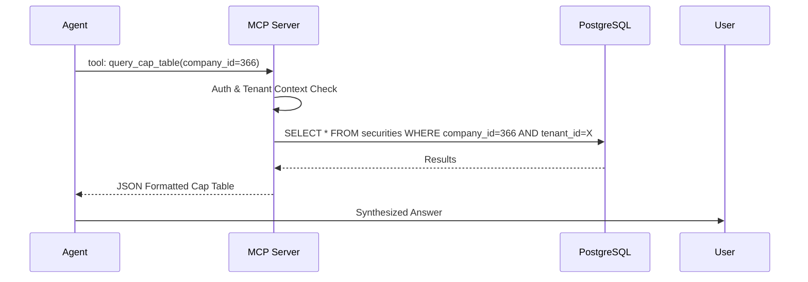

# Carta Extraction MCP Technical Specification

## 1. System Architecture

The system utilizes a dual-protocol architecture wrapping a unified core. It exposes both standard REST (OpenAPI) endpoints for programmatic integrations and an MCP (Model Context Protocol) server interface for LLM/Agentic integrations.

```mermaid
graph TD
    Client[LLM Agent / Claude / MCP Client]
    REST_Client[Standard API Client]
    
    subgraph FastAPI Application
        MCP_Router[MCP Server SDK Router]
        REST_Router[OpenAPI Router]
        
        Core[Core Service Layer]
        Auth[Auth & Multi-Tenancy Middleware]
        RateLimit[Rate Limiter]
        Audit[Audit Logger]
        
        MCP_Router --> Auth
        REST_Router --> Auth
        Auth --> RateLimit
        RateLimit --> Core
        Core --> Audit
    End
    
    subgraph Data Persistence
        PG[(PostgreSQL Database)]
        JSON[(JSON Blob Storage)]
    End
    
    Client -- "stdio / SSE" --> MCP_Router
    REST_Client -- "HTTPS" --> REST_Router
    Core --> PG
    Core --> JSON
```

## 2. Security & Governance

### 2.1 Authentication & Multi-Tenancy
- **Standard**: API Keys (`X-API-Key` header) mapped to specific service accounts.
- **Multi-Tenancy**: The database enforces strict multi-tenancy. Every table requires a `tenant_id` (representing the `firm_id` or `org_pk`).
- **Data Isolation**: All API and MCP requests are automatically scoped to the `tenant_id` associated with the provided API Key.

### 2.2 Rate Limiting
- **Global Limits**: 100 requests per minute per IP.
- **Tenant Limits**: 1,000 requests per minute per `tenant_id`.
- **Extraction Limits**: Max 5 concurrent extraction jobs per `tenant_id`.

### 2.3 Audit Logging
All writes and analytical queries are logged to the `audit_logs` table (or standard output stream for ELK stack ingestion), capturing:
- `timestamp`, `tenant_id`, `api_key_id`, `endpoint/tool_name`, `request_payload_hash`, `response_status`, `duration_ms`.

---

## 3. Sequence Diagrams

### 3.1 Extraction & Indexing Flow


### 3.2 Query Flow (Agentic)


---

## 4. MCP Definition

### 4.1 MCP Resources
Resources provide static or semi-static context to the LLM.

- `carta://{tenant_id}/entities/funds`: Lists all funds available to the tenant.
- `carta://{tenant_id}/entities/companies`: Lists all portfolio companies.
- `carta://{tenant_id}/jobs/latest`: The latest extraction manifest and success metrics.

### 4.2 MCP Tools
Tools are dynamic capabilities the LLM can invoke.

#### `query_cap_table`
Fetches capitalization data for a specific portfolio company.
- **Parameters**: 
  - `company_id` (string, required): The ID of the portfolio company.
  - `as_of_date` (string, optional): ISO date for historical cap tables.
- **Returns**: JSON array of securities, owners, and quantities.

#### `get_fund_irr`
Fetches IRR and performance metrics for a specific fund.
- **Parameters**:
  - `fund_id` (string, required): The ID of the fund.
- **Returns**: JSON object with Deal IRR, Gross IRR, and metric dates.

#### `trigger_extraction`
Triggers a background job to extract fresh data from Carta.
- **Parameters**:
  - `target_type` (string, required): Either `firm`, `fund`, or `company`.
  - `target_id` (string, required): The specific ID to extract.
- **Returns**: Job ID and status URL.
